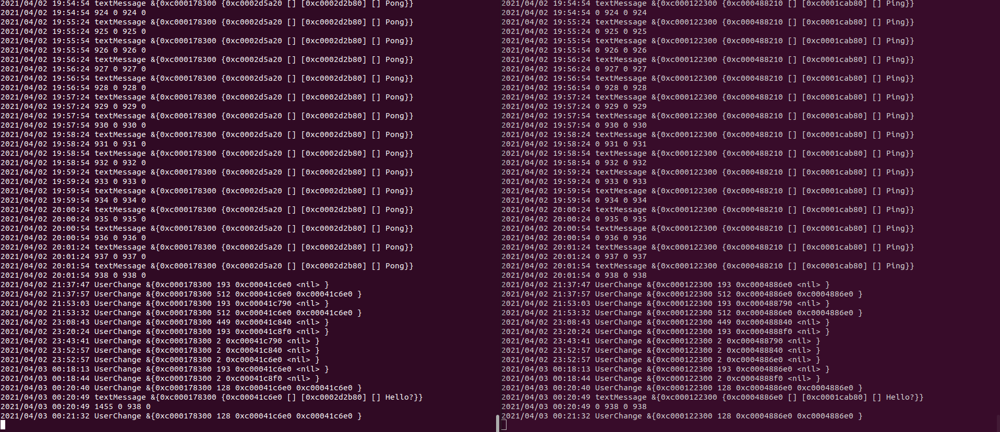

# Gumble Echo Test

A simle gumble echo application.
This application was created in attempt to reproduce an error seen in mumble-discord-bridge with a minimal code set.

## The Error

Gumble clients appear to loose the ability to send messages to channels after extended periods of connectivity.
This issue usually appears within 24 hours of uninterrupted connectivity.

## Test Setup

The test involves two instances of this application being spawned to carry out a ping-pong response cycle every 30 seconds.
When a message is received this application prints the number of ping and pongs, sent and received.

### Server

Murmur 1.3.0

Digital Ocean Server

Nothing interesting in the Murmur logs.


### Clients

Go 1.16.2
Ubuntu 20.04

```bash
go run *.go --mumble-address=example.com --mumble-username=Pinger --pinger
```

```bash
go run *.go --mumble-address=example.com --mumble-username=Ponger
```

## Results

The following image demonstrates the error.
It can be seen that the ping-pong cycle is consistent every 30 seconds until the pinger appears to be unable to send messages to the channel.
This image is of an active mumble server and we can see activity of other participants.
Finally a message "Hello?" is sent in the channel containing both Pinger and Ponger.
Pinger prints its summary showing that it has attempted to send ~ 1400 pings.
As a third party observer in the channel the failure appears to be Pingers ability to send messages to the channel and not Pongers ability to receive.
That can be confirmed by Ponger responding the "Hello?" message and printing the summary.

